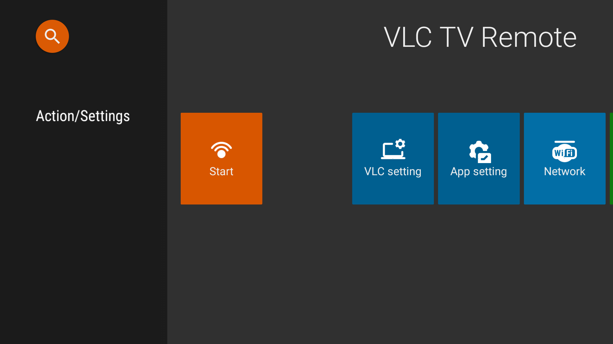
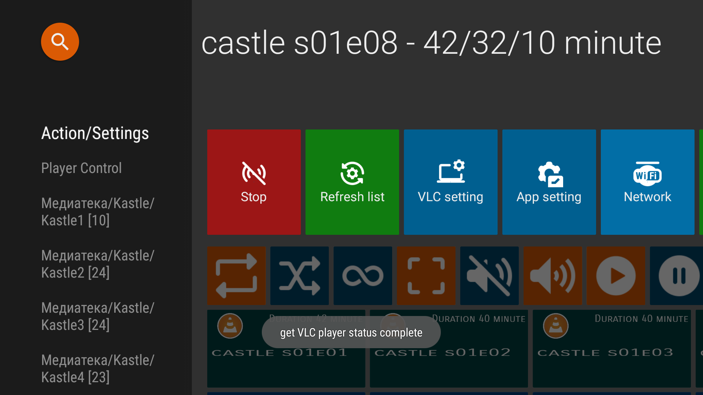
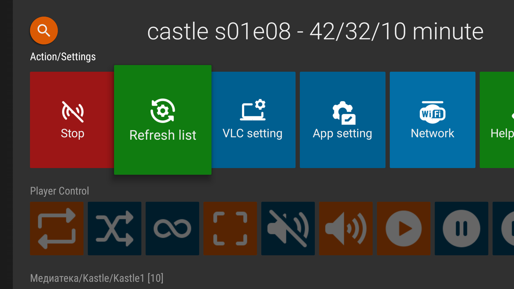
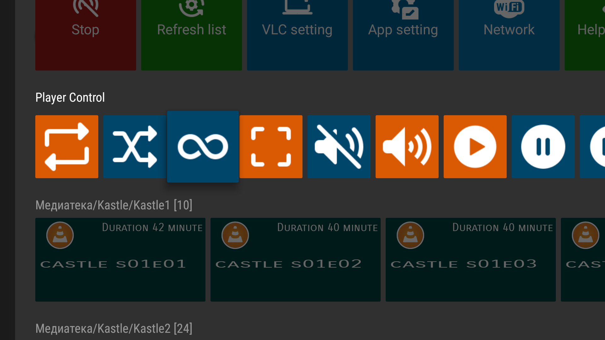
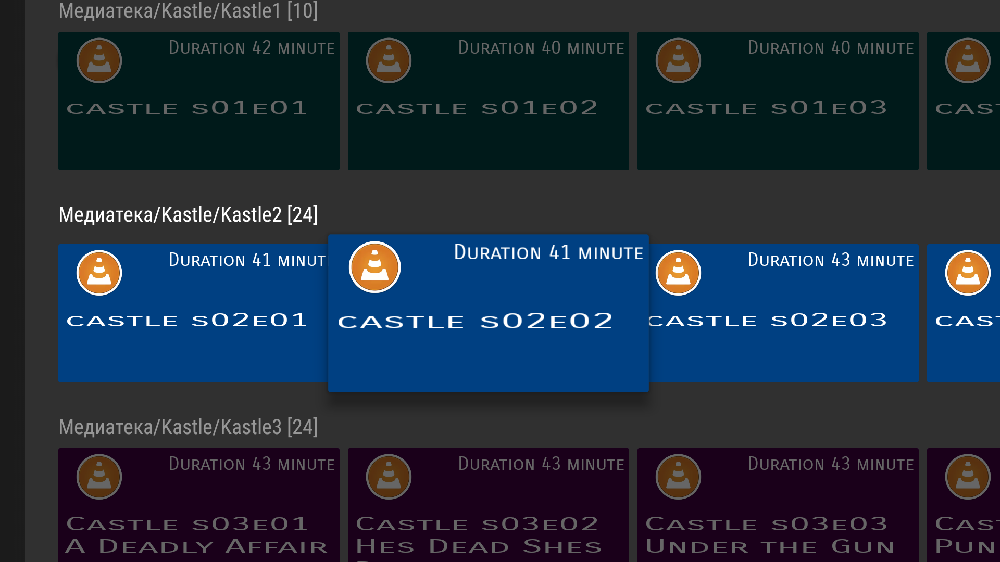
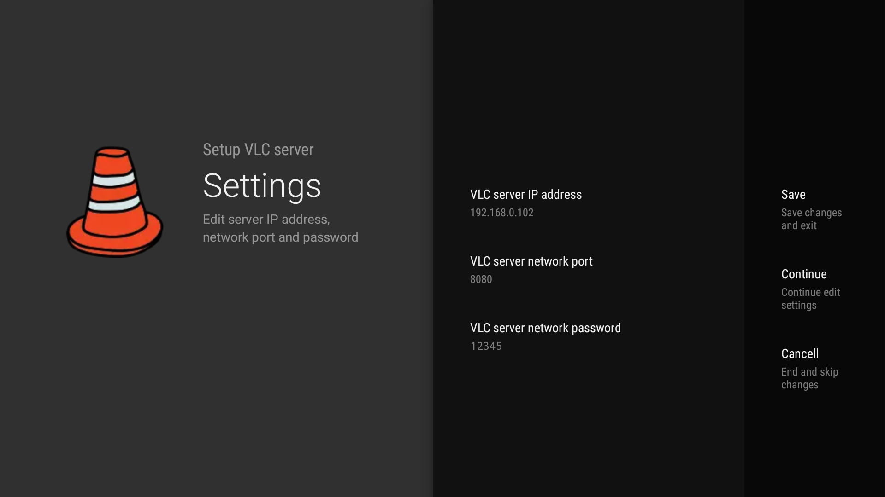
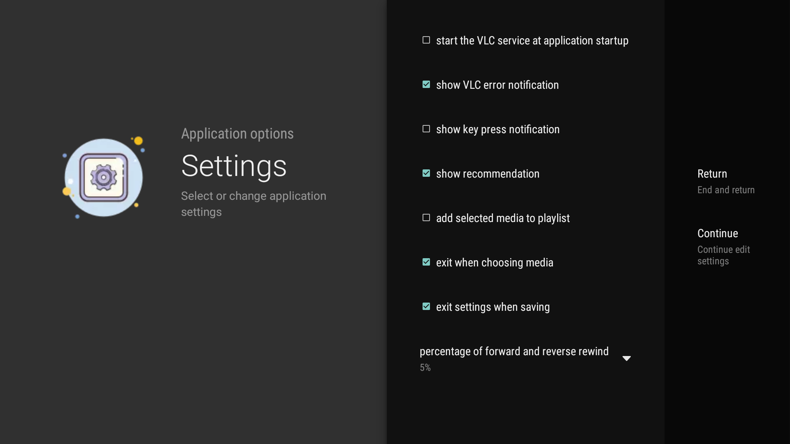
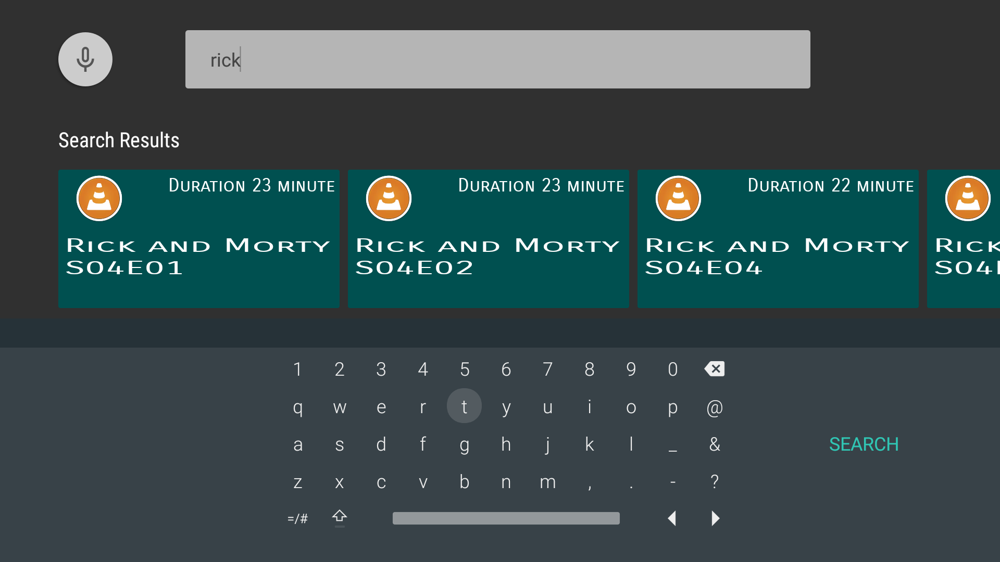

The application is intended for use with Android TV equipment, check your device, it may be incompatible with the requirements..  
There are no ads or purchases in the application.  

It is understood that the remote device where the VLC player is running, connected to the Android TV device via HDMI or another wired method.  

Also, the devices must be connected over a local network using Ethernet or Wi-Fi.  
Devices can be in different networks, taking into account the network routing settings.  

- [download release apk 1.0](https://github.com/CloneTV/VLC-TV-Remote/releases/download/1.0/avlctv-remote-release.apk) (`minimum API 24, Nougat 7.0`)
- [download current snapshot apk](release/avlctv-remote-release.apk)

### Tested on models

24LE7911D, 32LE7511D, 32LE7521D, 32LE7162D, 32LE7912D, 43LE7512D, 43LE7912D, 43LE7913D, 49LE7912D, 49LE7713D, 50LE7513D, 55LE7713D, 55LE7913D, 65LE7113D  
