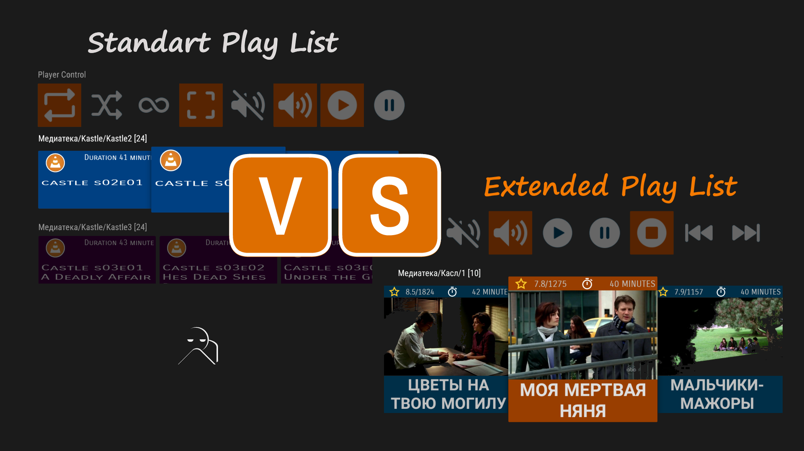
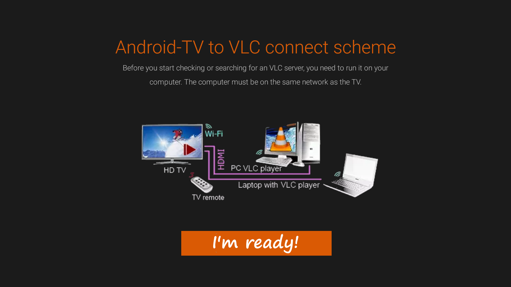

The application is intended for use with Android TV equipment, check your device, it may be incompatible with the requirements..  
There are no ads or purchases in the application.  

It is understood that the remote device where the VLC player is running, connected to the Android TV device via HDMI or another wired method.  

Also, the devices must be connected over a local network using Ethernet or Wi-Fi.  
Devices can be in different networks, taking into account the network routing settings.  

- [download current APK release](https://github.com/CloneTV/VLC-TV-Remote/releases/download/1.2.0/avlctv-remote-release.apk) (`minimum API 24, Nougat 7.0`)
- [download VLC AddOn MediaPlayList](https://github.com/CloneTV/VLC-TV-Remote/releases/download/1.2.0/VLCAddOnMediaPlayList.exe) (`tested VLC version 3.0.8 Vetinari`)
- [download Tablet/Phone remote](https://github.com/CloneTV/VLC-TV-Remote/releases/download/1.2.0/vlcatv-phone-tablet-remote-release.apk) (`minimum API24, Nougat 7.0`)

---

## New in version 1.2.x:

- automatic find VLC server in local network  
- ambilight background  
- extended multimedia playlist, compatible `Kodi`, `XMBC`, `MediaServer`  
- remembers the latest playbacks, making it easy to return to them  
- VLC addOn `MediaPlayList`  
- add remote control App from phone/tablet devices  

---

# Remote for remote :)

The remote control for Android-TV VLC player allows you to control all functions from a tablet or phone. 
You can view information about the current video fragment, or the browsing history with photos and a description.  

  

- [screenshot phone/tablet remote](phone-tablet-remote-Page.md)  

# VLC Playlist VS VLC MediaPlayList AddOn

Get a more attractive appearance and greater functionality using a VLC Media PlayList.  You can use the [tinyMediaManager](https://www.tinymediamanager.org/) to collect detailed information about your films, seasons and series.  
A complete software package, including a tinyMediaManager and VLC Android-TV remote APK, is included in the installation package VLC AddOn MediaPlayList.  
AddOn uses local `NFO` format files to receive information used by `Kodi` (`XBMC`) and `MediaPortal`.  

  

- [screenshot using VLC default PlayList](VLC-default-PlayList-Page.md)  
- [screenshot using VLC AddOn Media Play List](VLC-Media-PlayList-Page.md)

---

---

### Tested on models

24LE7911D, 32LE7511D, 32LE7521D, 32LE7162D, 32LE7912D, 43LE7512D, 43LE7912D, 43LE7913D, 49LE7912D, 49LE7713D, 50LE7513D, 55LE7713D, 55LE7913D, 65LE7113D  
