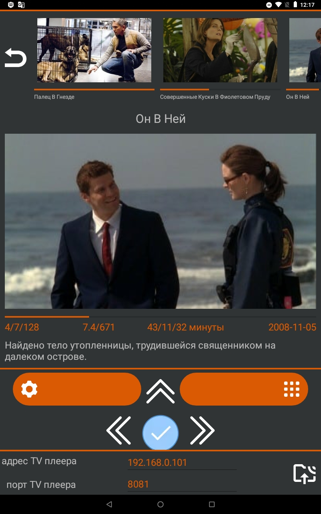
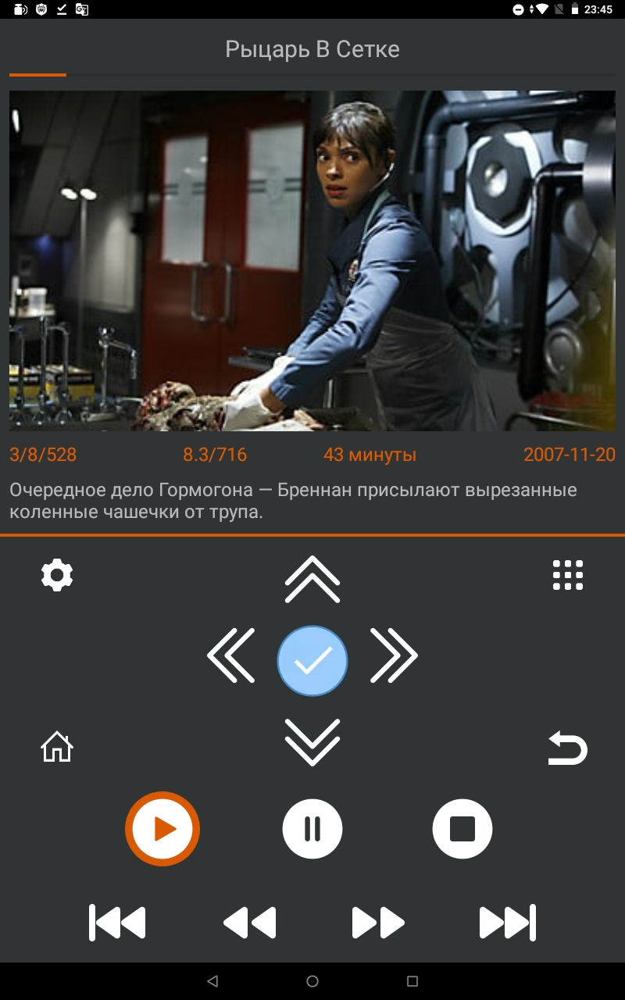
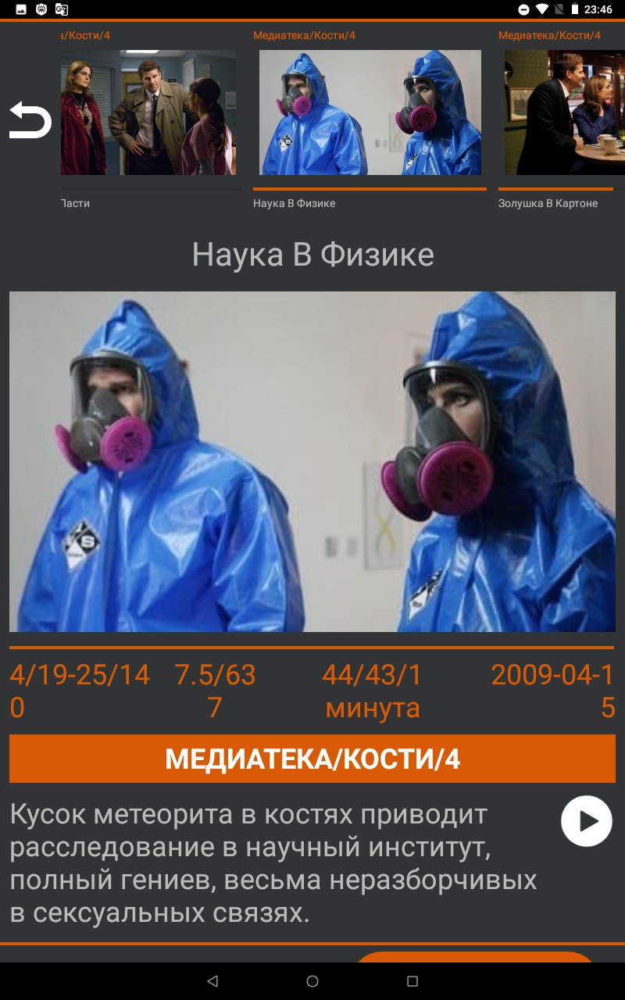
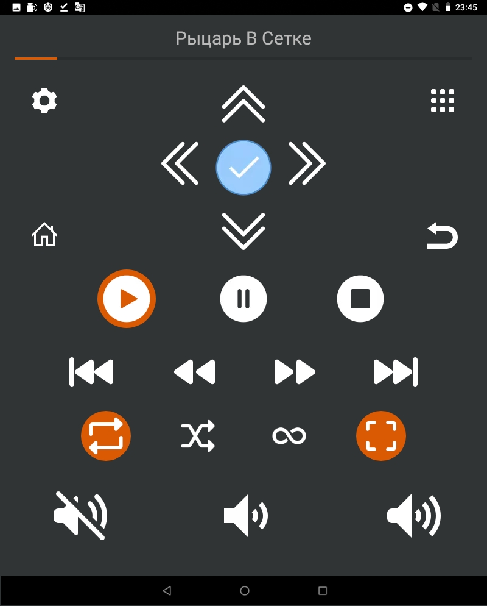
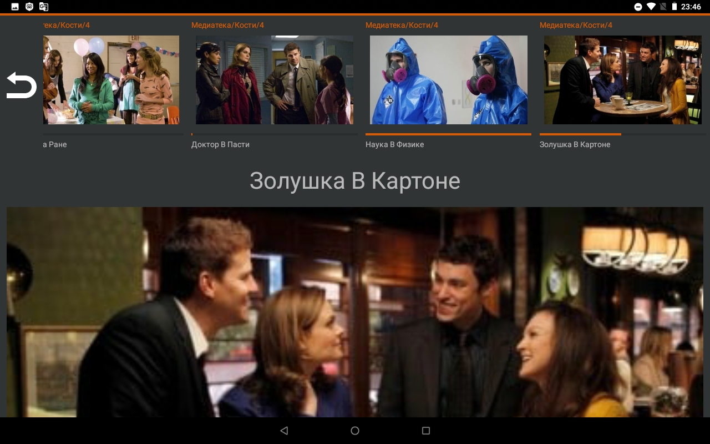

# screenshot Remote Control for Android-TV VLC player

---

The remote control for Android-TV VLC player allows you to control all functions from a tablet or phone.  
You can view information about the current video fragment, or the browsing history with photos and a description.  

---

